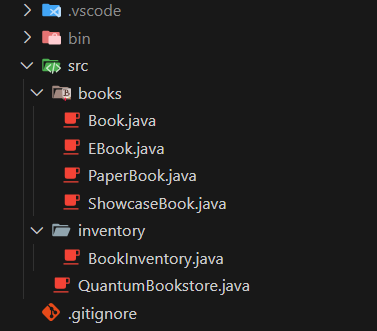
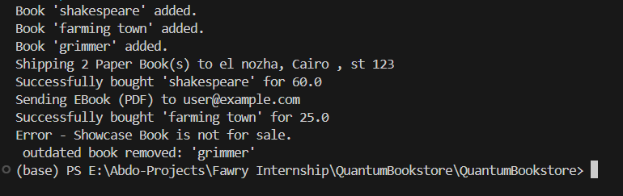
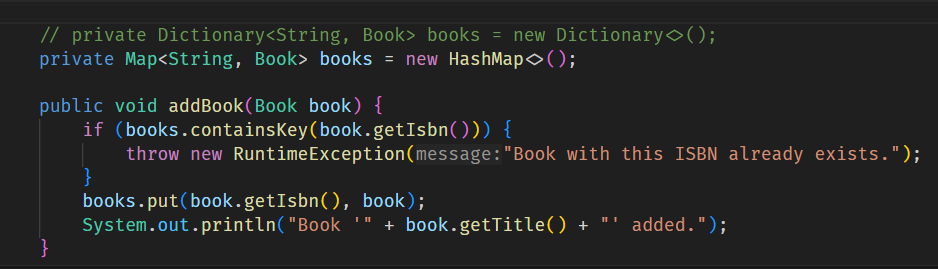
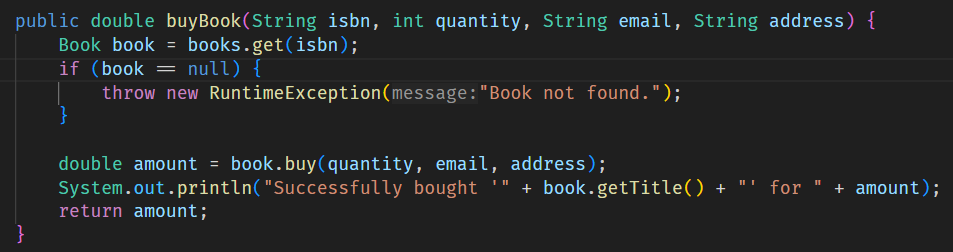

# 📚 Quantum Bookstore

Quantum Bookstore is a Java application that simulates an online bookstore system service. It supports different types of books and inventory management.

------

## 📦 Technologies Used

- java 17.0.12 2024-07-16 LTS
- Object-Oriented Programming (OOP)
- Data Structures like Maps & lists

## 🧪 Test Scenarios Covered

- Normal purchase flow for PaperBook and EBook
- Handling invalid purchase (e.g., showcase book)
- Automatic removal of outdated books

------

## 🚀 Features

- Add different types of books:
  - 📦 `PaperBook` (shipped to a physical address)
  - 📧 `EBook` (sent via email)
  - 🚫 `ShowcaseBook` (not for sale)
- Remove outdated books older than a configurable number of years
- Buy books using ISBN, quantity, email, and address
- Easily extensible system (add new product types without modifying existing logic)
- Clear console messages prefixed with `Quantum Bookstore`

---

## 🏗️ Project Structure

###

---

## 📷 Screenshots

### ▶️ Add & List Books

---

### 💰 Buying a Book

<!-- Add screenshot here -->

---

